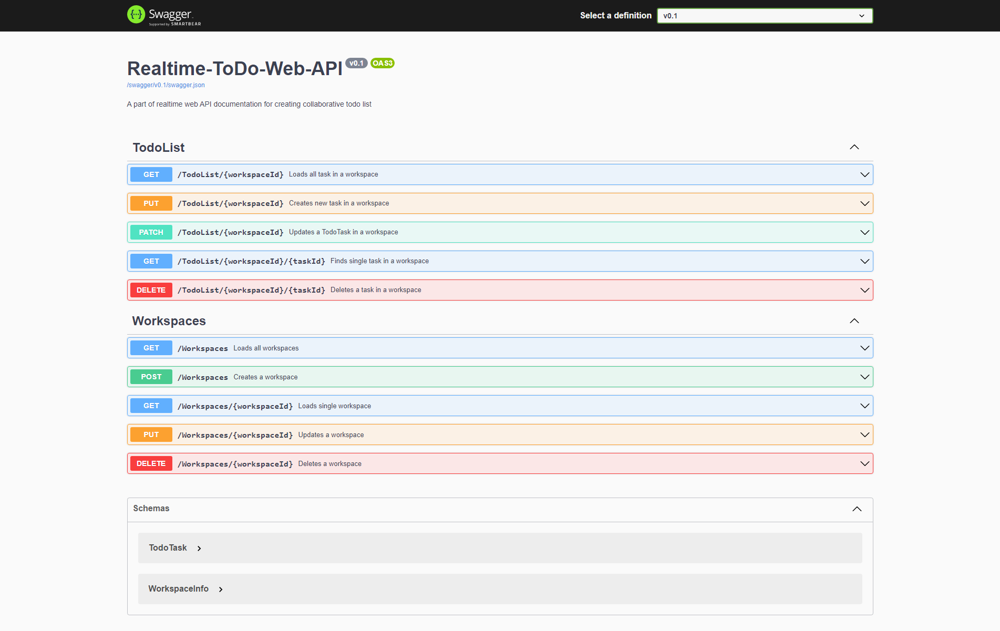

# How to use this API

## About this API

The Realtime ToDo Web API is a tool designed for managing tasks and workspaces in a real-time collaborative environment. It provides developers with a seamless way to integrate task management functionality into their applications. This API is designed to be self-hosted, meaning you are responsible for [hosting and running](./how-to-run.md) the project on your own infrastructure.

> [!IMPORTANT]
> This API does not include built-in authentication or authorization mechanisms. As the project is intended to be self-hosted, the responsibility for implementing authentication and authorization falls on the host. This gives you the flexibility to choose and implement the authentication and authorization methods that best fit your project's requirements and security needs.

### Key Features

- **Real-time Task Management:** Collaboratively create, update, and delete tasks in real time across connected workspaces.
- **Workspace Management:** Create, update, and delete workspaces to organize tasks based on specific projects or teams.

## Rest API

The Realtime ToDo Web API provides two ways of interacting with its functionality: REST API and SignalR Hub. This section will focus on the REST API, which offers a straightforward and easy-to-use approach for managing tasks and workspaces. However, it's important to note that the **REST API does not provide real-time updates or notifications about changes in the data.**

The REST API allows you to perform CRUD (Create, Read, Update, Delete) operations on tasks and workspaces using standard HTTP methods. It follows the principles of REST and provides a set of well-defined endpoints for accessing the API resources. To use the REST API, you can make HTTP requests to the appropriate endpoints using tools such as cURL, Postman, or any programming language with HTTP client capabilities. You will receive JSON responses containing the requested data or relevant status codes.

### Explore endpoints with swagger UI

The base URL for accessing the API endpoints is ```https://your-api-domain.com/```. Replace your-api-domain.com with the actual domain or IP address where the API is hosted. This link will navigate you to the Swagger UI.

Once you open Swagger UI, you will see a list of available API endpoints organized by their respective controllers. You can expand each endpoint to view detailed information about its parameters, request body (if applicable), and expected responses. Additionally, Swagger UI allows you to provide input values, execute requests, and see the corresponding responses within the browser itself.



> [!NOTE]
> Please note that Swagger UI is primarily intended for development and testing purposes. In a production environment, it is recommended to secure and restrict access to the API documentation and consider using alternative methods, such as custom client applications or automated API clients, to interact with the API.

## Install and connect to SignalR

The Realtime ToDo Web API offers a SignalR Hub that enables real-time communication and updates between the server and clients. By connecting to the SignalR Hub, you can receive instant notifications about changes in the ToDo list and workspaces.

### Install SignalR library

To use SignalR in your project, you need to install the SignalR library. The installation process may vary depending on the programming language and framework you are using. Here is how to install the SignalR library using npm:

```
npm init -y
npm install @microsoft/signalr
```

Now you can connect to hubs:

```
const connection = new signalR.HubConnectionBuilder()
    .withUrl("https/your-domain.www/workspaces")
    .build();
```

> [!TIP]
> For more information about how to set up SignalR at your front read [the official Microsoft documentation](https://learn.microsoft.com/en-us/aspnet/core/signalr/javascript-client?view=aspnetcore-7.0)

In the next sections, we will explore the available methods and events provided by the Realtime ToDo Web API's SignalR Hub and see how you can leverage them to interact with the ToDo list and workspaces in real time.

### Workspaces hub

The Realtime ToDo Web API provides a Workspaces Hub through SignalR, which allows real-time communication and updates related to workspaces. The Workspaces Hub enables you to perform operations such as adding workspaces, updating workspace names, and deleting workspaces.

The endpoint for this hub is ```.../workspaces```:

```
const connection = new signalR.HubConnectionBuilder()
    .withUrl("https/your-domain.www/workspaces")
    .build();

await connection.start();
```

After connecting to this hub you can invoke methods:

```
await connection.invoke('AddWorkspace', workspaceName);
await connection.invoke('UpdateWorkspaceName', workspaceId, workspaceName);
await connection.invoke('DeleteWorkspace', workspaceId);
```

***[To see all available methods open the documentation](../api/Realtime_ToDo_Web_API.Hubs.WorkspacesHub.yml)***

### Workspaces hub events

To react to changes in workspaces in real time you have to handle corresponding events:

```
connection.on('AddWorkspace', (workspace) => {
  // Handle the newly added workspace. Update UI
});

connection.on('UpdateWorkspaceName', (workspaceId, newName) => {
  // Handle the updated workspace name. Update UI
});

connection.on('DeleteWorkspace', (workspaceId) => {
  // Handle the deleted workspace. Update UI
});
```

***[To see all events open the documentation](../api/Realtime_ToDo_Web_API.Hubs.IWorkspacesClient.yml)***

### Todolist hub

The Realtime ToDo Web API includes a TodoList Hub implemented using SignalR, which enables real-time communication and updates related to todo tasks within workspaces. The TodoList Hub allows you to perform various operations, including adding tasks, updating task details, and deleting tasks.

The endpoint for this hub is ```.../board```:

```
const connection = new signalR.HubConnectionBuilder()
    .withUrl("https/your-domain.www/board")
    .build();

await connection.start();
```

Before invoking actions on todo task, you have to select the workspace, you are working with. Invoke  ConnectToWorkspace method:
```
await connection.invoke('ConnectToWorkspace', WorkspaceId);
```

You can also specify initial workspace while connecting to the hub by adding workspaceId query string ```.../board?workspaceid=1```:

```
const connection = new signalR.HubConnectionBuilder()
    .withUrl("https/your-domain.www/board?workspaceid=1")
    .build();
```

Now you can invoke actions on todo tasks:

```
await connection.invoke('AddTask', taskTitle, taskDeadline);
await connection.invoke('UpdateTaskOrder', taskId, newTaskOrder);
await connection.invoke('DeleteTask', taskId);
...
```

***[To see all available methods open the documentation](../api/Realtime_ToDo_Web_API.Hubs.TodoListHub.yml)***

### Todo list hub events

To react to changes in todo list in real time you have to handle corresponding events:

```
connection.on('AddTask', (task) => {
    // Handle the newly added task. Update UI
});
connection.on('UpdateTaskCompleted', (taskId, newCompleted) => {
    // Handle the updated task. Update UI
});
connection.on('DeleteTask', (taskId) => {
    // Handle the deleted task. Update UI
});
...
```

***[To see all events open the documentation](../api/Realtime_ToDo_Web_API.Hubs.ITodoListClient.yml)***

## Create your Frontend

To integrate the Realtime ToDo Web API into your frontend application, follow these steps:

1. **Import SignalR library:** Begin by importing the SignalR library specific to your frontend framework or technology stack. This library provides the necessary functions and utilities to establish connections and interact with SignalR hubs.

2. **Fetch all workspaces:** Use the Rest API endpoints provided by the Realtime ToDo Web API to fetch a list of all workspaces. This can be done during the application initialization or when the user accesses the relevant section. Store the retrieved workspace data for future reference.

3. **Connect to Workspaces Hub:** Establish a connection to the Workspaces Hub using the SignalR library. Provide the appropriate URL to connect to the hub and listen for updates. Handle connection events such as "connected" and "disconnected" to manage the connection state.

4. **Provide actions for managing workspaces:** Implement functionality in your frontend application to add, update, and delete workspaces using the methods provided by the Workspaces Hub. This allows users to create new workspaces, rename existing ones, and delete unwanted workspaces.

5. **Open workspace and load tasks:** Add an action in your application to allow users to open a specific workspace. When a workspace is opened, fetch all its associated tasks using the Rest API endpoints. Display the tasks to the user and keep them synchronized with any changes made by other connected clients.

6. **Listen to updates in a workspace using TodoListHub:** Create a connection to the TodoListHub using the SignalR library. This will enable your frontend application to receive real-time updates for tasks within the currently active workspace. Implement event handlers for task-related events, such as task addition, update, and deletion.

7. **Provide actions for managing tasks using TodoListHub:** Implement functionality in your application to perform task-related actions using the methods provided by the TodoListHub. Users should be able to add new tasks, update task details, mark tasks as completed, change task deadlines, and reorder tasks within the active workspace.

8. **Change active workspace using TodoListHub Connect method:** Allow users to switch between different workspaces by utilizing the connect method provided by the TodoListHub. When a user selects a different workspace, disconnect from the current workspace's TodoListHub connection and connect to the new workspace using the connect method. This ensures that users receive updates specific to the newly selected workspace.

By following these steps, you can integrate the Realtime ToDo Web API into your frontend application, enabling real-time collaboration and seamless task management within workspaces.